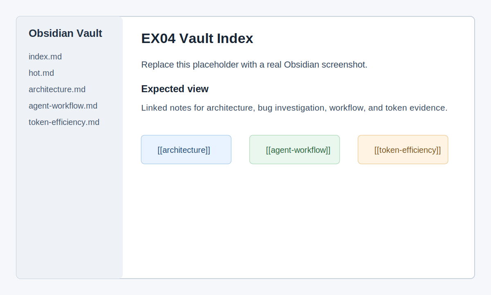
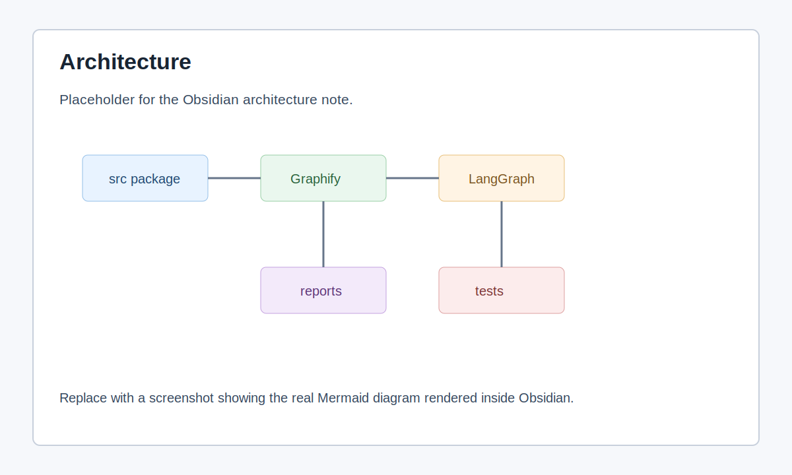
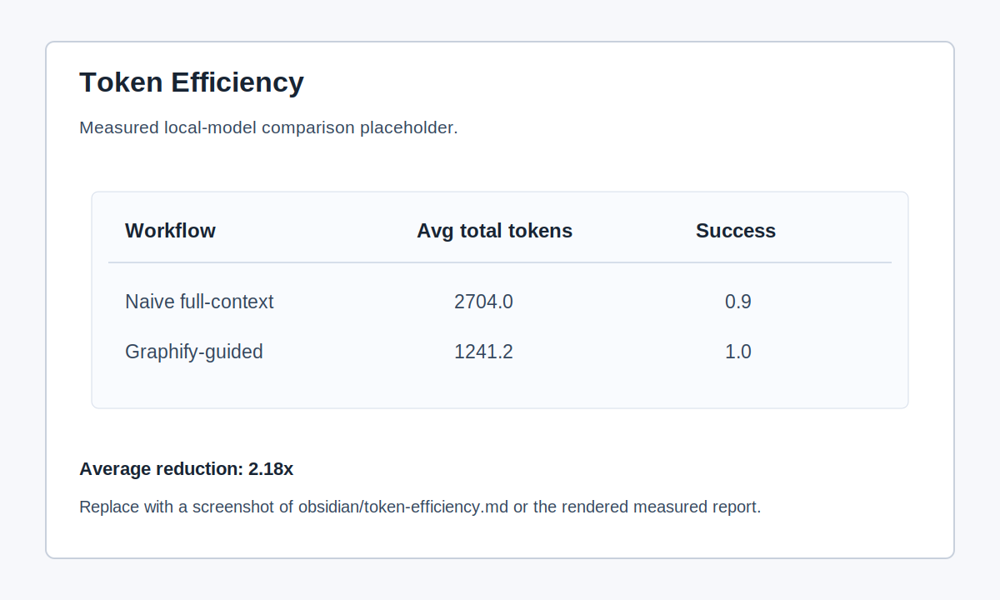

# EX04: Graph-Guided Agentic Debugging

This repository is a complete EX04 submission. It reverse engineers a small
unfamiliar Python debugging codebase, generates Graphify artifacts, documents
the architecture in an Obsidian-style vault, preserves one bug for diagnosis,
and compares token usage between naive and graph-guided workflows. The selected
bug remains in source so the AI must diagnose it and suggest a solution.

## Selected Repository

Source: `andela/buggy-python` (HW PDF recommendation).

I selected this repository because it is intentionally small, Python-only, and
contains classic debugging exercises. That keeps the assignment focused on
reverse engineering, graph navigation, root-cause analysis, and measurable
agent workflow design instead of dependency setup. It also keeps the prompts
small enough to stay compatible with local AI models running through Ollama,
which was important for measuring token usage locally instead of depending on a
cloud-only model.

## Repository Layout

```text
README.md
requirements.txt
pyproject.toml
src/buggy_python/
tests/
agent/
obsidian/
reports/
artifacts/
data/
```

## Bug Preserved

The selected bug is the mutable default argument in `foo()`. The repository keeps
the broken implementation intentionally:

Original broken behavior:

```python
def foo(bar=[]):
    bar.append("baz")
    return bar
```

Because Python evaluates default arguments once, repeated calls reuse the same
list. The expected suggested fix is to use `None` as a sentinel:

```python
def foo(bar=None):
    if bar is None:
        bar = []
    bar.append("baz")
    return bar
```

## Graphify Outputs

Graphify was run against `src/`:

```powershell
python -m graphify extract src --out . --no-cluster
python -m graphify cluster-only . --graph graphify-out\graph.json --no-label --no-viz
```

Important graph artifacts:

- `data/graph.json`
- `obsidian/index.md`
- `obsidian/hot.md`
- `reports/GRAPH_REPORT.md`

Graph summary:

- 19 nodes
- 31 edges
- 4 communities
- No import cycles

## Agentic Workflow

The graph-guided debugging workflow is implemented with LangGraph in
`agent/workflow.py`.

Workflow stages:

1. `graph_reader` loads `data/graph.json` and extracts the `foo()` neighborhood.
2. `bug_investigator` loads `agent/prompts/bug_investigator.md` and asks an LLM
   to identify the root cause from graph-bounded context.
3. `fix_planner` loads `agent/prompts/fix_planner.md` and asks an LLM for a
   minimal patch and regression-test plan without modifying source.
4. `verifier` runs `python -m pytest -q`; the known bug regression is marked
   `xfail` so the suite documents the bug without requiring it to be patched.

Set `OPENAI_API_KEY` to run the investigation and planning steps with an LLM.
`OPENAI_MODEL` is optional. If no API key is present, the workflow marks
`llm_used: false` and uses a local fallback so the repo can still be verified.

## Token Efficiency

The committed token-efficiency evidence is the measured local-model trial in
`reports/MEASURED_TOKEN_COMPARISON.md` and
`data/measured-token-comparison.json`.

Measured with local model `gemma4:e2b` through Ollama over 10 runs:

| Workflow | Avg prompt tokens | Avg completion tokens | Avg total tokens | Success rate |
| --- | ---: | ---: | ---: | ---: |
| Naive full-context | 1914.0 | 790.0 | 2704.0 | 0.9 |
| Graphify-guided | 683.0 | 558.2 | 1241.2 | 1.0 |

Average total-token reduction: `2.18x`.

During local testing, different models showed different behavior. Larger or
reasoning-heavy models produced longer completions and sometimes took much
longer to finish, while smaller local models produced shorter but less stable
answers. The final committed comparison uses one reproducible 10-run local trial
with `gemma4:e2b`; earlier exploratory runs with other local models showed why
the selected codebase needed to remain small enough for local inference.

To reproduce the measured comparison:

```powershell
python agent\compare_token_usage.py --base-url http://localhost:11434/v1 --api-key ollama --model gemma4:e2b --runs 10
```

The LLM prompts use the current broken source. `data/original-bug-context.json`
stores the expected behavior and suggested-solution criteria.

## Diagrams and Vault

The Obsidian vault is under `obsidian/` and starts at `obsidian/index.md`.

Diagram artifacts:

- `artifacts/architecture-diagram.mmd`
- `artifacts/oop-diagram.mmd`
- `artifacts/investigation-flow.mmd`

## Obsidian Screenshots

The images below are placeholders. Replace them with real Obsidian screenshots
after opening the `obsidian/` folder as a vault.



The vault index should show the linked note structure: `hot`, `architecture`,
`oop`, `bug-investigation`, `agent-workflow`, `token-efficiency`, and
`before-after`. This demonstrates that the reverse-engineering evidence is
navigable as an Obsidian knowledge base rather than isolated Markdown files.



The architecture screenshot should show the Mermaid block diagram from
`obsidian/architecture.md`, connecting the extracted package, Graphify graph,
LangGraph workflow, tests, reports, and vault notes.



The token-efficiency screenshot should show the measured local-model comparison:
naive full-context prompting versus Graphify-guided prompting, including average
tokens and success rates.

## Run It

Install dependencies:

```powershell
python -m pip install -r requirements.txt
```

Run tests:

```powershell
python -m pytest -q
```

Run the LangGraph workflow:

```powershell
python agent\workflow.py
```

Run it with an LLM:

```powershell
$env:OPENAI_API_KEY = "your_api_key"
$env:OPENAI_MODEL = "your_model_name"
python agent\workflow.py
```

Expected verification:

```text
2 passed, 1 xfailed
```
