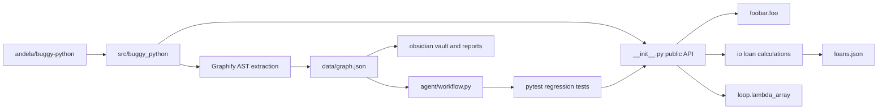
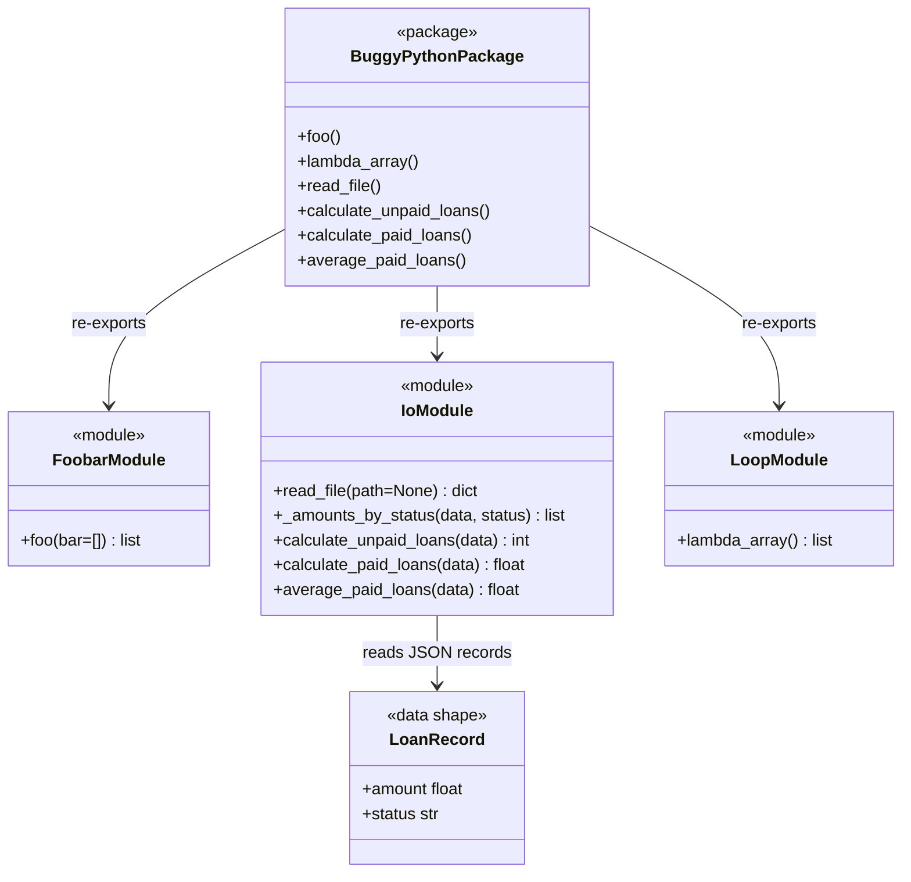
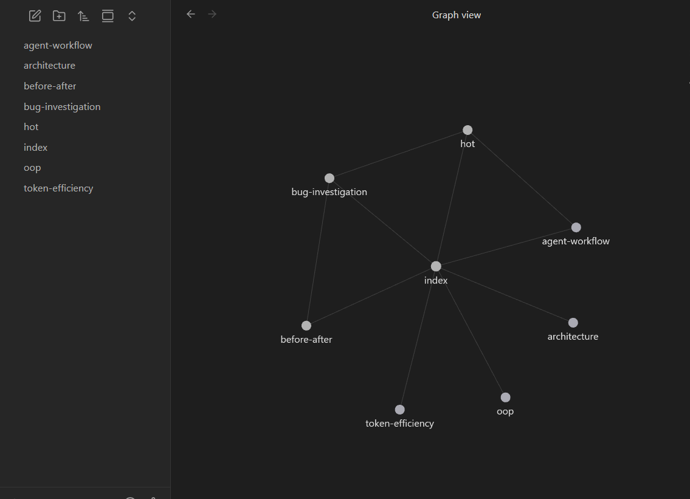

# EX04: Graph-Guided Agentic Debugging

This repository is a complete EX04 submission. It reverse engineers a small
unfamiliar Python debugging codebase, generates Graphify artifacts, documents
the architecture in an Obsidian-style vault, preserves one bug for diagnosis,
and compares token usage between naive and graph-guided workflows. The AI agent
diagnoses the bug from graph-guided context, and the fix is then applied in
source with a before/after record.

## Selected Repository

Source: `andela/buggy-python` (HW PDF recommendation).

I selected this repository because it is intentionally small, Python-only, and
contains classic debugging exercises. That keeps the assignment focused on
reverse engineering, graph navigation, root-cause analysis, and measurable
agent workflow design instead of dependency setup. It also keeps the prompts
small enough to stay compatible with local AI models running through Ollama,
which was important for measuring token usage locally instead of depending on a
cloud-only model.

## Research Questions

These are the questions (hw1 §4) that guided the investigation; each is answered
here and revisited in the reports and the Obsidian vault
(`obsidian/research-questions.md`).

1. **What is the project's real architecture, and what wasn't obvious at first
   glance?** The `buggy_python` package looks like a flat set of scripts, but the
   Graphify graph shows it is really three concerns: `foobar.py` (the
   mutable-default `foo()`), `io.py` + `loans.json` (file I/O via `read_file()`),
   and `loop.py`. The graph has 19 nodes, 31 edges, 4 communities, and no import
   cycles — the I/O data file clustering with `io.py` was not obvious from the
   file list alone. See `reports/GRAPH_REPORT.md` and `reports/ARCHITECTURE_REPORT.md`.

2. **Which components/modules/functions are the most central (God Nodes)?** The
   suspect-ranking extension scores `foo()` (1.167), `__init__.py` (1.000),
   `io.py` (0.722), `foobar.py` (0.667), and `read_file()` (0.611) highest.
   `__init__.py` is the structural hub (highest degree); `foo()` rises once the
   `foo()` seed proximity is included. See `reports/SUSPECT_RANKING.md`.

3. **How can the block and OOP schemas be extracted when the original docs are
   thin?** The Graphify communities and edges drive both: the architecture block
   diagram (`artifacts/architecture-diagram.mmd`) maps module-to-module flow, and
   the OOP/relationship diagram (`artifacts/oop-diagram.mmd`) captures the
   module/function relationships, rather than relying on a directory listing.

4. **How was the bug identified, what was the root cause, and what steps led
   there?** The agent's `graph_reader` started from `hot.md` and the `foo()`
   neighborhood (not a linear file read), surfacing `def foo(bar=[])`. Root cause:
   a mutable default argument evaluated once at definition time, so repeated
   implicit calls share one list. Fix: the `None`-sentinel form. See
   `reports/BUG_REPORT.md` and `artifacts/investigation-flow.mmd`.

5. **What was the advantage of graph-guided navigation vs. linear reading, how
   did the agent save tokens, and what extensions would we add?** Graph-guidance
   let the agent read **1 file** (`foobar.py`) plus the `foo()` neighborhood
   instead of all **6** source/test files, cutting total tokens **2.18x**
   (gemma3:4b) and **2.01x** (glm-4.7-flashx) at equal-or-better success. The
   original extension is the centrality + proximity suspect ranking
   (`agent/rank_suspects.py`). See the Token Efficiency and Extensions sections
   below.

## Repository Layout

```text
README.md
requirements.txt
pyproject.toml
src/buggy_python/
tests/
agent/
obsidian/
reports/
artifacts/
data/
```

## Bug Fixed (Before / After)

The selected bug is the mutable default argument in `foo()`.

Before (original broken behavior, preserved in
`data/original-bug-context.json` and in git history):

```python
def foo(bar=[]):
    bar.append("baz")
    return bar
```

Because Python evaluates default arguments once, repeated calls reused the same
list. After (the applied fix in `src/buggy_python/foobar.py`), `None` is used as a
sentinel and a fresh list is allocated per implicit call:

```python
def foo(bar=None):
    if bar is None:
        bar = []
    bar.append("baz")
    return bar
```

The regression test for this bug now passes (it was previously expected-failing).
The token experiment and the agent still diagnose against the preserved buggy
snapshot, so the measured runs continue to demonstrate finding the real bug.

## Graphify Outputs

Graphify was run against `src/`:

```powershell
python -m graphify extract src --out . --no-cluster
python -m graphify cluster-only . --graph graphify-out\graph.json --no-label --no-viz
```

Important graph artifacts:

- `data/graph.json`
- `obsidian/index.md`
- `obsidian/hot.md`
- `reports/GRAPH_REPORT.md`

Graph summary:

- 19 nodes
- 31 edges
- 4 communities
- No import cycles

## Agentic Workflow

The graph-guided debugging workflow is implemented with LangGraph in
`agent/workflow.py`.

Workflow stages:

1. `graph_reader` loads `data/graph.json`, extracts the `foo()` neighborhood, and
   feeds the preserved buggy snapshot as the source under investigation.
2. `bug_investigator` loads `agent/prompts/bug_investigator.md` and asks an LLM to
   identify the root cause from graph-bounded context; the model's answer drives
   `root_cause` and `evidence`.
3. `fix_planner` loads `agent/prompts/fix_planner.md` and asks an LLM for a minimal
   patch and regression-test plan, which becomes `fix_plan`.
4. `verifier` runs `python -m pytest -q`; with the fix applied the suite reports
   `3 passed`.

Set `OPENAI_API_KEY` to run the investigation and planning steps with an LLM (this
project uses GLM `glm-4.7-flashx` via the z.ai OpenAI-compatible endpoint; see
`.env`). `OPENAI_MODEL`/`OPENAI_BASE_URL` are configurable. If no API key is
present, the workflow marks `llm_used: false` and uses hardcoded fallbacks so the
repo can still be verified offline.

## Token Efficiency

The committed token-efficiency evidence is the combined two-model comparison in
`reports/MEASURED_TOKEN_COMPARISON.md`, backed by
`data/measured-token-comparison-gemma3-4b.json` (local) and
`data/measured-token-comparison-glm-4-7-flashx.json` (z.ai).

Measured on two models and kept side by side (neither overwrites the other):

The §5.5 metrics are: tokens consumed, files/textual units read, investigation
rounds, and quality (success rate) of reaching the root cause and fix.

| Model | Workflow | Avg prompt tokens | Avg completion tokens | Avg total tokens | Files read | Rounds | Success rate |
| --- | --- | ---: | ---: | ---: | ---: | ---: | ---: |
| `gemma3:4b` (local, 10 runs) | Naive full-context | 1914.0 | 790.0 | 2704.0 | 6 | 1 | 0.9 |
| `gemma3:4b` (local, 10 runs) | Graphify-guided | 683.0 | 558.2 | 1241.2 | 1 | 1 | 1.0 |
| `glm-4.7-flashx` (z.ai, 10 runs) | Naive full-context | 1672.0 | 1024.3 | 2696.3 | 6 | 1 | 1.0 |
| `glm-4.7-flashx` (z.ai, 10 runs) | Graphify-guided | 554.0 | 788.3 | 1342.3 | 1 | 1 | 0.9 |

Average total-token reduction: `gemma3:4b` **2.18x**, `glm-4.7-flashx` **2.01x**.
The naive run reads 6 files (`src/buggy_python/{__init__.py, foobar.py, io.py,
loans.json, loop.py}` + `tests/test_buggy_python.py`); the graph-guided run reads
1 file (`foobar.py`) plus the `foo()` graph neighborhood. Both modes diagnose in a
single investigation round.

Both a small local model and a larger cloud model show the same direction: the
graph-guided prompt uses far fewer prompt tokens and reaches the correct diagnosis
and fix at an equal or higher success rate. Completion length varies by model,
which is why the total-token reduction differs between backends but stays above 1x
in both.

To reproduce the measured comparison:

```powershell
python agent\compare_token_usage.py --base-url http://localhost:11434/v1 --api-key ollama --model gemma3:4b --runs 10
python agent\compare_token_usage.py --base-url https://api.z.ai/api/paas/v4/ --model glm-4.7-flashx --runs 10
```

The LLM prompts use the preserved buggy source from
`data/original-bug-context.json` (which also stores the expected behavior and
solution criteria), so the comparison still measures diagnosing the real bug even
though `src/buggy_python/foobar.py` is now fixed.

## Extensions

Beyond the core tasks, this submission adds a graph-based **suspect ranking**
extension in `agent/rank_suspects.py`. It reads `data/graph.json` and ranks every
node by a score that combines degree centrality with proximity (BFS distance) to a
seed node (`foo()` by default):

```
score = degree_centrality + 1 / (1 + distance_to_seed)
```

This tells the agent which nodes to inspect first when hunting a bug, rather than
reading the tree linearly. Run it:

```powershell
python agent\rank_suspects.py --seed "foo()" --top 10
```

The ranked output is written to `reports/SUSPECT_RANKING.md`. For the selected
bug, `foo()` and its closest well-connected neighbors (`__init__.py`, `foobar.py`)
rise to the top, matching the manual investigation path.

## Diagrams and Vault

The Obsidian vault is under `obsidian/` and starts at `obsidian/index.md`. The
two reverse-engineering schemas required by the assignment are embedded below;
the source `.mmd` files are in `artifacts/`.

### Architecture Block Diagram

System flow from the original repository through the extracted package, Graphify
extraction, the LangGraph agent, and the Obsidian vault
(`artifacts/architecture-diagram.mmd`):



### OOP / Module Relationship Diagram

The selected codebase is **procedural and defines no Python classes**, so this
schema documents the package, its three modules, and the `LoanRecord` JSON data
shape (with their public interfaces and `re-exports` / `reads` relationships)
rather than inheritance hierarchies (`artifacts/oop-diagram.mmd`):



The investigation flow diagram is in `artifacts/investigation-flow.mmd`.

## Obsidian Screenshots

The screenshot below was captured after opening the `obsidian/` folder as a
vault.



The vault index shows the linked note structure: `hot`, `architecture`,
`oop`, `bug-investigation`, `agent-workflow`, `token-efficiency`, and
`before-after`. This demonstrates that the reverse-engineering evidence is
navigable as an Obsidian knowledge base rather than isolated Markdown files.

The architecture note contains the Mermaid block diagram from
`obsidian/architecture.md`, connecting the extracted package, Graphify graph,
LangGraph workflow, tests, reports, and vault notes.

The token-efficiency note shows the measured local-model comparison:
naive full-context prompting versus Graphify-guided prompting, including average
tokens and success rates.

## Run It

Install dependencies:

```powershell
python -m pip install -r requirements.txt
```

Run tests:

```powershell
python -m pytest -q
```

Run the LangGraph workflow:

```powershell
python agent\workflow.py
```

Run it with a cloud OpenAI-compatible LLM:

```powershell
$env:OPENAI_API_KEY = "your_api_key"
$env:OPENAI_MODEL = "your_model_name"
python agent\workflow.py
```

Run it with a local Ollama model:

```powershell
$env:OPENAI_BASE_URL = "http://localhost:11434/v1"
$env:OPENAI_API_KEY = "ollama"
$env:OPENAI_MODEL = "gemma3:4b"
python agent\workflow.py
```

The workflow diagnoses the preserved bug from graph-guided context. The fix has
been applied in `src/buggy_python/foobar.py`.

Expected verification:

```text
3 passed
```
