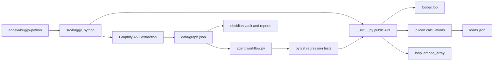

# Architecture Block Diagram

System flow from the original repository through the extracted package, Graphify
extraction, the LangGraph agent, and the Obsidian vault.

```mermaid
flowchart LR
  OriginalRepo["andela/buggy-python"] --> ExtractedPackage["src/buggy_python"]
  ExtractedPackage --> PublicAPI["__init__.py public API"]
  PublicAPI --> Foo["foobar.foo"]
  PublicAPI --> LoanIO["io loan calculations"]
  PublicAPI --> LambdaFactory["loop.lambda_array"]
  LoanIO --> DataFile["loans.json"]
  Tests["pytest regression tests"] --> PublicAPI
  Graphify["Graphify AST extraction"] --> GraphJson["data/graph.json"]
  ExtractedPackage --> Graphify
  GraphJson --> LangGraph["agent/workflow.py"]
  LangGraph --> Tests
  GraphJson --> Obsidian["obsidian vault and reports"]
```
