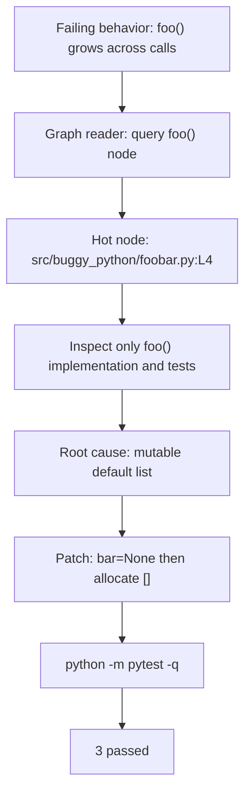

# Agent Workflow

The debugging agent is implemented in `agent/workflow.py` with LangGraph.

## Nodes

- `graph_reader`: loads `data/graph.json` and extracts the `foo()` neighborhood.
- `bug_investigator`: loads `agent/prompts/bug_investigator.md` and calls an LLM
  when `OPENAI_API_KEY` is configured.
- `fix_planner`: loads `agent/prompts/fix_planner.md` and calls an LLM for the
  patch plan when credentials are configured.
- `verifier`: runs `python -m pytest -q`.

The workflow is LLM-enabled. It also has an explicit local fallback for
credential-free verification; fallback runs show `llm_used: false`.
