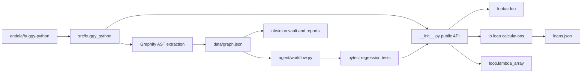

# Architecture

The extracted project is a small Python package with three public behavior
areas: list/default-argument behavior, loan-file calculations, and lambda
generation.

The architecture is intentionally flat. That makes it a good assignment target:
the graph still reveals public API exposure and impact radius without requiring
large-project setup.

