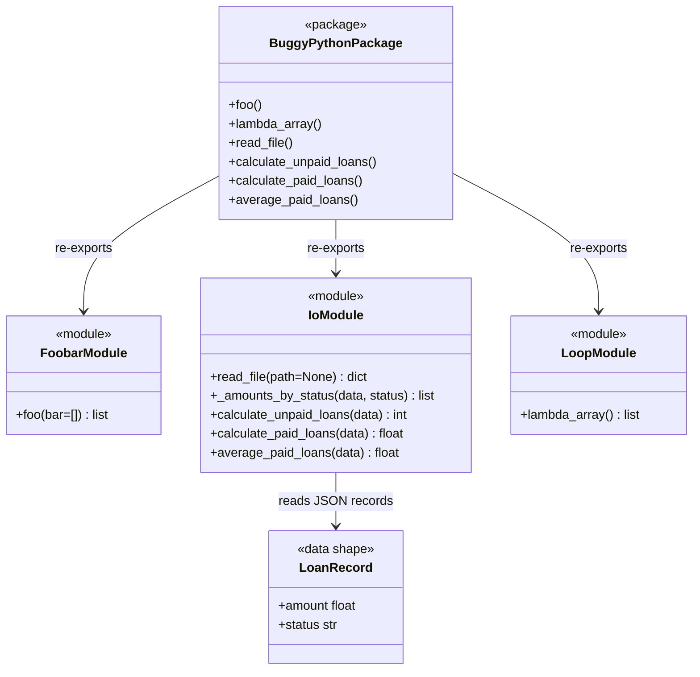

# OOP and Module Relationships

The selected codebase is procedural and does not define Python classes. The
diagram below documents the public module relationships and the JSON record
shape used by the calculation functions.

This is still an OOP/class relationship artifact because it records the absence
of classes and the effective public interface boundaries.
